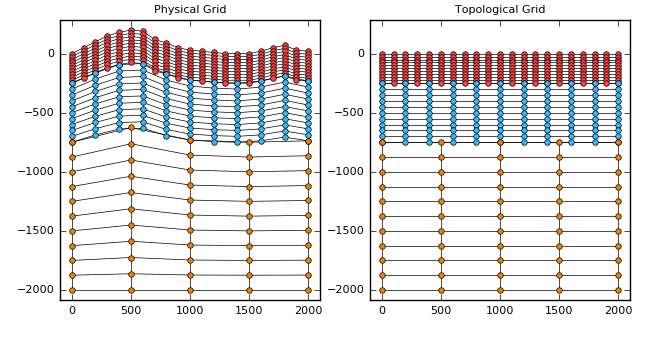

# GeoModelGrids

Georeferenced grid-based models composed of blocks, where each block
is a uniform grid with potentially different resolutions.

The main use case is 3-D seismic velocity models for use in modeling
earthquake ground motions.

## Physical and Topological Grids

