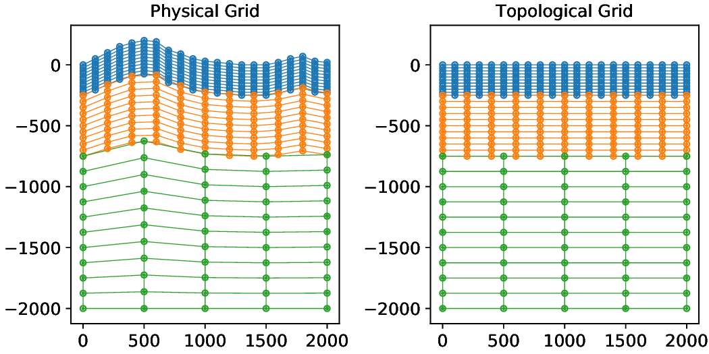
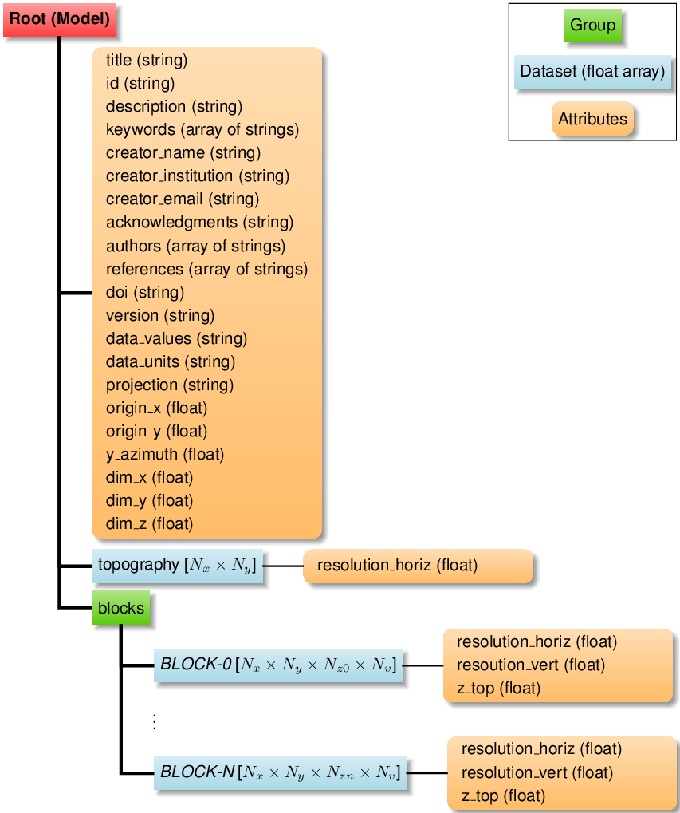

# Storage Layout

## Model Representation

We map the physical space of the model domain bounded by on the top by
topography (or a flat surface) into logical space that has uniform
regular grids.

<figure>
  
</figure>

The mapping from the physical space to topological space is:
```
z_logical = -dim_z * (z_topography - z_physical) / (z_topography + dim_z)
```


## HDF5 Storage Scheme

The model is stored in an HDF5 file. The elevation of the ground
surface (topography) is stored in the `topography` dataset if it is not
a flat surface at sea level. The grids are stored in the `blocks`
group. Attributes are included at the root level and for each data set
in order to yield a self-describing model. That is, no additional
metadata is needed to define the model.

<figure>
  
</figure>

## Model Metadata

### Description

* **title** *(string)* Title of the model.
* **id** *(string)* Model identifier.
* **description** *(string)* Description of the model.
* **keywords** *(array of strings)* Keywords describing the model.
* **creator_name** *(string)* Name of person who created the HDF5 version of the model.
* **creator_institution** *(string)* Institution/organization of model creator.
* **creator_email** *(string)* Email of model creator.
* **acknowledgments** *(string)* Acknowledgments for the model.
* **authors** *(array of strings)* Model authors.
* **references** *(array of strings)* Publications describing the model.
* **doi** *(string)* Digital Object Identifier for model.
* **version** *(string)* Version of model.

### Model Data

* **data_values** *(array of strings)* Names of values in model grids.
* **data_units** *(array of strings)* Units of values in model grids.

### Model Storage

* **crs** *(string)* Coordinate reference system (CRS) in Proj.4 format, WKT, or EPSG code.
* **origin_x** *(float)* X coordinate of origin of model in CRS coordinates.
* **origin_y** *(float)* Y coordinate of origin of model in CRS coordinates.
* **y_azimuth** *(float)* Azimuth (degrees clockwise from north) of y axis.
* **dim_x** *(float)* Dimension of model in local (rotated) x direction in units of CRS coordinates.
* **dim_y** *(float)* Dimension of model in local (rotated) y direction in units of CRS coordinates.
* **dim_z** *(float)* Dimension of model in local z direction in units of CRS coordinates.

## Topography Metadata

* **resolution_horiz** *(float)* Horizontal resolution in units of CRS coordinates.

## Block Metadata

* **resolution_horiz** *(float)* Horizontal resolution in units of CRS coordinates.
* **resolution_vert** *(float)* Vertical resolution in units of CRS coordinates.
* **z_top** *(float)* Z coordinate of top of block in topological space.
